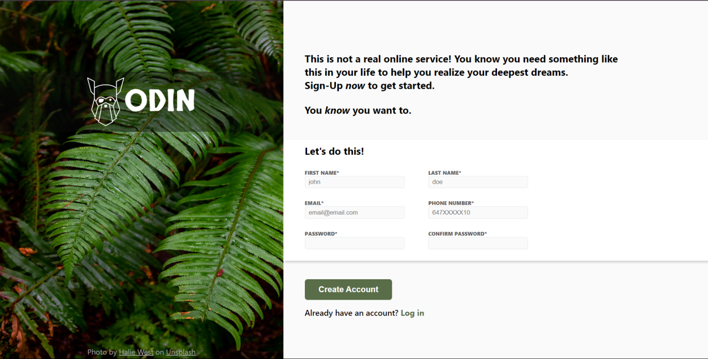

# Sign-up Form

Welcome to the Sign-up Form Project! This form is designed to showcase my learning about HTML forms, their functionality, and basic styling.

## Table of Contents

- [Live Website](#live-website)
- [preview](#preview)
- [Features](#features)
- [Usage](#usage)
- [Getting Started](#getting-started)
- [Built With](#built-with)
- [Contributing](#contributing)
- [License](#license)

## Live Website

- Live Preview: [Sign-up Form](https://rajatthedev.github.io/Signup-Form/)

## Preview

## Features

- **Validation:** Input fields have patterns and requirements specified to ensure valid user input, including uppercase and lowercase formats for names, valid email format, a 10-digit phone number, and password strength requirements.
- **Styling:** The form features basic styling to enhance its visual appearance and readability, including custom fonts imported from Google Fonts.
- **Error Handling:** Users are notified of input errors through HTML5 form validation messages and title attributes that explain the required format for each field.

## Usage

- Input your first name, last name, email, phone number, password, and confirm password in the respective fields.
- Follow the specified patterns and requirements for each input field.
- Click the "Create Account" button to submit the form.

## Getting Started

Follow these steps in order to kickstart your project:

1. Clone the Repository: `git clone git@github.com:RajatTheDev/Signup-Form.git`
2. Open the `index.html` file in your preferred browser to view the content. 🌐

## Built With

- HTML
- CSS

## Contributing

Contributions are welcome! If you have ideas for improvement or want to add features, please fork the repository and submit a pull request. 🚀

## License
This project is licensed under the MIT License - see the [License](LICENSE) file for details.